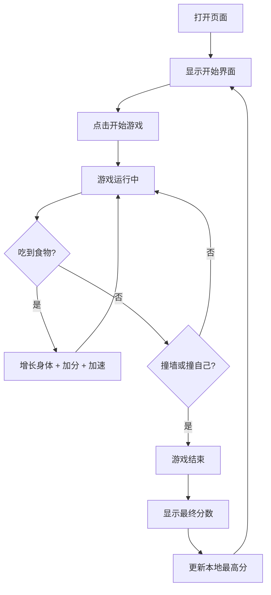

## 1. 产品概述

一款复古霓虹风格的贪吃蛇网页游戏，玩家通过键盘或触屏控制蛇的移动，吃掉食物获得分数并增长蛇身。游戏支持电脑和手机端游玩，采用响应式设计和触摸控制优化，带来流畅的跨设备体验。

## 2. 核心功能

### 2.1 功能模块
1. **游戏主页面**：游戏画布、分数显示、控制按钮、游戏状态切换
2. **排行榜（本地）**：最高分记录与展示

### 2.2 页面详情
| 页面名称 | 模块名称 | 功能描述 |
|---------|---------|---------|
| 游戏主页面 | 游戏画布 | Canvas 渲染蛇、食物、网格背景和粒子特效 |
| 游戏主页面 | 分数面板 | 实时显示当前分数、最高分和当前等级/速度 |
| 游戏主页面 | 虚拟方向键 | 手机屏幕显示的触摸方向控制按钮 |
| 游戏主页面 | 开始/暂停/结束遮罩 | 游戏状态切换与结果展示 |

## 3. 核心流程

玩家打开页面后，游戏显示开始界面。点击"开始游戏"后，蛇开始移动，玩家通过键盘方向键或屏幕虚拟方向键控制蛇的移动方向。蛇吃到食物后增长身体并获得分数，速度逐渐加快。当蛇撞到墙壁或自身时游戏结束，显示最终分数，并更新本地最高分记录。玩家可以选择重新开始。

## 4. 用户界面设计

### 4.1 设计风格
- **主色调**：深黑背景 `#0a0a0f`，霓虹绿蛇身 `#39ff14`，霓虹粉食物 `#ff007f`
- **按钮风格**：半透明玻璃态（glassmorphism），圆角 `12px`，带霓虹发光边框
- **字体**：标题使用等宽复古字体 'Press Start 2P'，分数使用 'Courier New'
- **布局风格**：居中单列布局，游戏画布居中，控制面板在下方
- **图标/装饰**：像素风格，极简线条

### 4.2 页面设计概览
| 页面名称 | 模块名称 | UI 元素 |
|---------|---------|---------|
| 游戏主页面 | 游戏画布 | 深色网格背景，霓虹发光蛇身，脉冲食物，粒子爆炸特效 |
| 游戏主页面 | 分数面板 | 顶部显示当前分数和最高分，发光文字效果 |
| 游戏主页面 | 虚拟方向键 | 手机端底部显示十字方向键，半透明圆形按钮 |
| 游戏主页面 | 状态遮罩 | 毛玻璃背景，居中显示游戏标题/分数/操作按钮 |

### 4.3 响应式设计
- **桌面端**：画布最大 600x600，使用键盘方向键/WASD控制，显示操作提示
- **手机端**：画布适配屏幕宽度（最大 100vw - 32px），底部显示虚拟方向键，触摸优化防止页面滚动
- **通用**：禁止页面滚动和触摸缩放，确保游戏控制不触发浏览器默认行为

### 4.4 动画与特效
- 蛇身移动平滑过渡
- 食物脉冲发光动画（CSS 动画）
- 吃食物时的粒子爆炸效果（Canvas 粒子系统）
- 游戏结束时的屏幕闪烁效果
