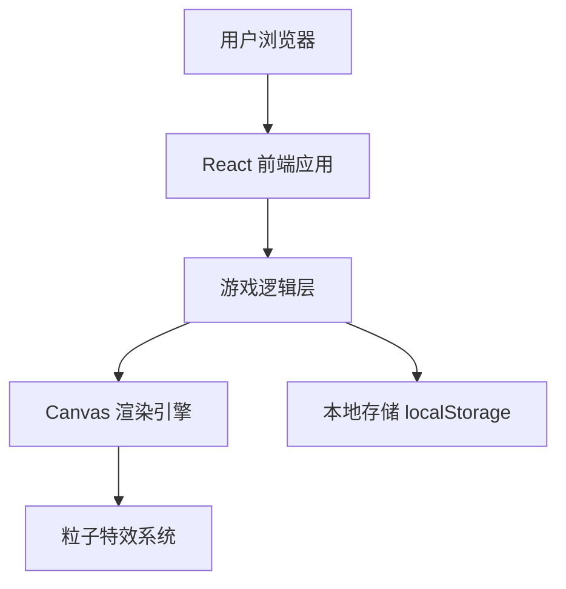

## 1. 架构设计



## 2. 技术描述

- **前端框架**：React 18 + TypeScript
- **构建工具**：Vite
- **样式方案**：Tailwind CSS + 自定义 CSS 变量
- **状态管理**：Zustand（游戏状态、分数、最高分）
- **渲染**：HTML5 Canvas API
- **存储**：localStorage（持久化最高分）
- **字体**：Google Fonts 'Press Start 2P'

## 3. 路由定义

| 路由 | 用途 |
|------|------|
| / | 游戏主页面（单页面应用） |

## 4. 数据模型

### 4.1 游戏状态
```typescript
interface GameState {
  snake: { x: number; y: number }[];
  food: { x: number; y: number };
  direction: 'UP' | 'DOWN' | 'LEFT' | 'RIGHT';
  score: number;
  highScore: number;
  speed: number;
  isRunning: boolean;
  isGameOver: boolean;
}
```

### 4.2 粒子特效
```typescript
interface Particle {
  x: number;
  y: number;
  vx: number;
  vy: number;
  life: number;
  color: string;
}
```
